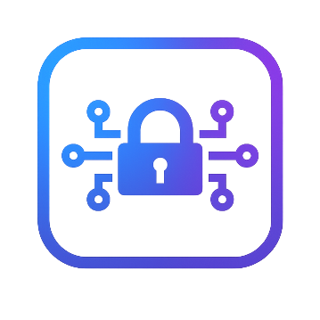

# Nook

[](https://www.rust-lang.org)
[](LICENSE)
[](FOSS_PLURALISM_MANIFESTO.md)

**Your private Dropbox—encrypted end-to-end, even from the server.**

Push and pull files through hostile networks, traffic-intercepting proxies, and compromised servers—without revealing a single filename nor bit of data.



> A nook is a small, quiet, or sheltered area, such as a cozy corner in a room, an alcove, or a secluded spot in nature. The term often implies privacy, comfort, or a space set aside for a specific purpose, like a "breakfast nook" or a "reading nook."

## Overview

Nook is a minimal end-to-end-encrypted file store designed to operate correctly in **fully untrusted environments**, including TLS-intercepting firewalls, corporate MITM proxies, hostile networks, and server compromise scenarios.

### Core principle

**No file contents, filenames, directory structure, paths, or filesystem semantics may ever appear outside authenticated encryption.**

The server is a **semantic null**—it understands only random object IDs and ciphertext. All meaning exists exclusively on the client.

One `nookd` server hosts multiple **vaults**: credential-gated storage containers provisioned by the server operator. Each vault holds any number of **namespaces**: independently encrypted volumes whose keys never leave the clients. Access to a vault says nothing about the ability to read its namespaces—that requires the corresponding namespace key.

### Key features

- **Mandatory end-to-end encryption (E2EE)**: Every file, directory name, and path is encrypted before leaving the client
- **Amorphous traffic**: All payloads are indistinguishable encrypted blobs; the server cannot differentiate between files, manifests, or metadata
- **TLS-MITM resistant**: Confidentiality does not rely on TLS; even complete TLS interception reveals nothing
- **Atomic updates**: Safe concurrent writers using compare-and-swap (CAS) semantics
- **Multi-tenant**: One server hosts many credential-gated **vaults**, each holding any number of independently encrypted **namespaces**, with per-vault storage quotas
- **Authenticated requests**: Every request is HMAC-signed with the vault credential; the credential itself never travels on the wire
- **Simple deployment**: One Rust server binary (`nookd`), one Rust CLI binary (`nook`)
- **Zero-knowledge server**: Server compromise yields only ciphertext

### What Nook is NOT

- Not a sync daemon (no background sync)
- Not a version control system (no merge, diff, or conflict resolution)
- Not traffic-analysis resistant (volume and timing remain observable)
- Not a backup system with versioning

Nook is for pushing and pulling complete encrypted snapshots of directory trees between devices you control, through infrastructure you don't trust.

## Requirements

- Rust (stable) + Cargo

## Build / install

From the repo root:

```bash
cargo build --release
```

Binaries will be at:

- `target/release/nook` (CLI client)
- `target/release/nookd` (server daemon)

Optional install to Cargo bin dir:

```bash
cargo install --path crates/nook
cargo install --path crates/nookd
```

## Run the server

```bash
./target/release/nookd serve --listen 0.0.0.0:8080 --storage ./storage
```

The server stores only encrypted blobs, nested by vault and namespace, under the storage
directory:

```text
storage/
  objects/
    <vault_id>/
      <namespace_id>/
        <object_id>
  temp/
  meta.sqlite
```

The storage directory is also settable via `NOOK_DATA_DIR`. A default per-vault storage quota (in
bytes) can be set via `--quota-bytes`/`NOOK_QUOTA_BYTES` (unset means unlimited, unless a vault has
its own override — see below); uploads that would exceed a vault's quota are rejected with
`507 Insufficient Storage`.

### Create a vault

Nook is not user-based: `nookd` manages **vaults** (server-side storage/access containers) and
**namespaces** (client-side encrypted volumes inside a vault), not user accounts. A vault is
created locally by the server operator — never over the network, so no anonymous caller can
self-provision unlimited storage:

```bash
./target/release/nookd vault create --storage ./storage
# vault_id:         <64-char hex>
# vault_credential: <64-char hex>
# (shown exactly once — store it securely; if lost, revoke and create a new vault)
```

Give the printed `vault_id`/`vault_credential` to the first user of this vault through a secure
out-of-band channel (in person, a password manager entry, an encrypted message — the same channel
you'd already trust to share a key). That user can then choose to share the same credentials with
collaborators, letting them use the same server-side storage (see "Share a namespace" below for how
they keep their data private from each other regardless).

Other vault management commands:

```bash
./target/release/nookd vault list --storage ./storage      # usage, never prints credentials
./target/release/nookd vault revoke <vault_id> --storage ./storage   # blocks access; data retained
```

### Run the server in a container (Podman / Docker)

```bash
podman build -f crates/nookd/Dockerfile -t nookd .
podman volume create nookd-data
podman run -d --name nookd -p 8080:8080 -v nookd-data:/data nookd
```

The container declares `/data` as a `VOLUME` — the object store and `meta.sqlite` live there, so a
named volume (as above) or a bind mount keeps data across container recreation. `docker` works the
same way (swap `podman` for `docker`).

To use a host directory instead of a named volume, the directory must be writable by the
container's fixed user (UID/GID `10001`). With rootless Podman, set that up via `podman unshare`
so the ownership is correct inside the container's user namespace:

```bash
mkdir -p ./data
podman unshare chown 10001:10001 ./data
podman run -d --name nookd -p 8080:8080 -v ./data:/data:Z nookd
```

With Docker (no user namespace remapping by default), a plain `chown 10001:10001 ./data` on the
host is enough.

## Initialize a namespace (client)

Using a vault requires the `vault_id`/`vault_credential` from the operator (see "Create a vault"
above):

```bash
./target/release/nook init \
  --server http://127.0.0.1:8080 \
  --vault-id <vault_id> \
  --vault-credential <vault_credential> \
  --root /path/to/files
```

This generates a fresh **namespace** (SPEC-004's replacement for what earlier versions called "the
vault key") and stores it — together with the vault credential — in the OS keychain by default
(macOS Keychain, Windows Credential Manager, or the Secret Service on Linux). If no keychain is
available — headless servers, CI, some Linux setups — `nook init` falls back to encrypting both
with a passphrase (Argon2id + XChaCha20-Poly1305) and storing the encrypted blob in the client
config. Set `NOOK_PASSPHRASE` to supply the passphrase non-interactively (scripted/CI use);
otherwise `nook init` prompts for it.

Client config is written as TOML to the platform config directory (`~/.config/nook/config.toml`
on Linux). The namespace key and vault credential are never written there in recoverable form —
only a keychain reference or an encrypted blob. `vault_id`/`namespace_id` are non-secret and stored
in plain TOML.

Set or view the local root later:

```bash
./target/release/nook root --set /path/to/files
./target/release/nook root
```

### Share a namespace

Each `nook init` (without `--import-namespace`) creates its own private namespace — even two
clients using the same vault credentials cannot read each other's data unless they explicitly share
a namespace key:

```bash
# On the sharing device:
./target/release/nook namespace export
# nookns1:<namespace_id>:<base64 namespace key>

# On the receiving device, using the same vault_id/vault_credential:
./target/release/nook init \
  --server http://127.0.0.1:8080 \
  --vault-id <vault_id> \
  --vault-credential <vault_credential> \
  --import-namespace <bundle from above> \
  --root /path/to/files
```

Both devices now have full read/write access to the same namespace — pass the bundle over a
secure out-of-band channel, the same way you would a passphrase.

## Push / pull

Push uploads files to the namespace. Pushing merges with existing content—files are added or updated, but other files are preserved:

```bash
./target/release/nook push              # Push entire root directory
./target/release/nook push README.md     # Push a single file
./target/release/nook push docs/         # Push a subdirectory
```

Pull downloads and materializes files from the namespace into your local root:

```bash
./target/release/nook pull               # Pull entire namespace
./target/release/nook pull docs/spec.md  # Pull a specific file
./target/release/nook pull images/       # Pull a subdirectory
```

Both commands preserve directory structure and support selective sync.

## Remove files / space reclamation

Remove a file or an entire directory subtree from the namespace (local files
under your root are never touched):

```bash
./target/release/nook rm docs/spec.md   # Remove a single file
./target/release/nook rm docs/          # Remove a directory subtree
```

Garbage collection is automatic — there is no `gc` command. After every
successful `push` or `rm`, the client deletes objects the updated manifest no
longer references: content replaced by that push is reclaimed immediately,
and historical orphans (e.g. residue of an interrupted push) are reclaimed
once older than a grace window (default 24 hours, configurable via
`gc_grace_seconds` in the client config or the `NOOK_GC_GRACE_SECONDS`
environment variable). The grace window protects a concurrent pusher's
uploaded-but-not-yet-linked objects from being swept mid-push; object ages
are compared against server-issued timestamps only, so client clock skew
cannot cause data loss. Freed space is subtracted from the vault's quota
immediately. Deletion is final — Nook has no versioning or trash.

Like everything else, cleanup is client-driven: the server cannot tell live
objects from garbage (it only ever sees opaque IDs and ciphertext), so it
never deletes anything on its own initiative. Against an older `nookd`
without deletion support, `push`/`rm` still work and simply warn that space
reclamation was skipped.

## Status / overrides

Check whether the head object exists on the server:

```bash
./target/release/nook status
```

Override the server URL per command:

```bash
./target/release/nook --server http://other-host:8080 status
./target/release/nook --server http://other-host:8080 push
```

## Browse namespace contents

List the top-level entries stored in the encrypted manifest:

```bash
./target/release/nook ls
./target/release/nook ls path/inside/namespace   # List a subdirectory
```

View a recursive tree of the namespace structure:

```bash
./target/release/nook tree
./target/release/nook tree docs/             # Tree from a subdirectory
```

All discovery happens locally by decrypting the manifest—no server queries reveal structure.

## Usage notes

- The server is a semantic null: it stores only ciphertext and vault/namespace/object IDs.
- TLS can be used, but confidentiality does not rely on it; TLS MITM does not expose filenames,
  paths, or file contents. Reads and writes do require a valid vault credential regardless of TLS
  (see [`SECURITY.md`](./SECURITY.md)).
- To use the same namespace on multiple devices, see "Share a namespace" above, then set the local
  root on each device.

## Participation

Contributions are welcome: issues, pull requests, critique, and discussion.

For an overview of how the implementation fits together (crates, crypto,
wire protocol, server/client internals, GC), see
[`TECH-IMPLEMENTATION-GUIDE.md`](./TECH-IMPLEMENTATION-GUIDE.md).

This project follows the [FOSS Pluralism Manifesto](./FOSS_PLURALISM_MANIFESTO.md), affirming respect for people, freedom to critique ideas, and space for diverse perspectives.

## License

Copyright (c) 2026 Iwan van der Kleijn
Licensed under the MIT License. See [`LICENSE`](./LICENSE) for details.
